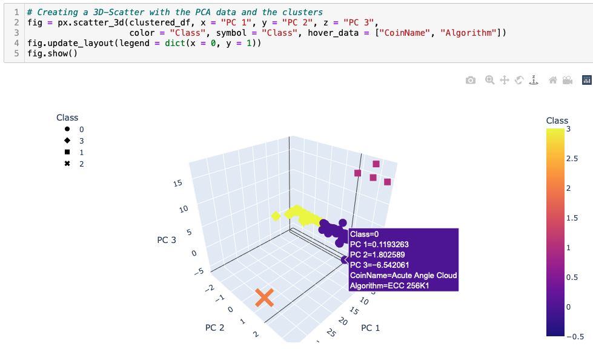
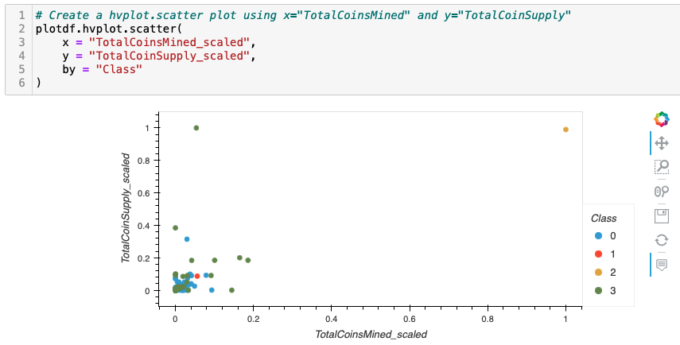

# Cryptocurrencies, Module 18 Challenge

Martha is a senior manager for the Advisory Services Team at Accountability Accounting, one of your most important clients. Accountability Accounting, a prominent investment bank, is interested in offering a new cryptocurrency investment portfolio for its customers. The company, however, is lost in the vast universe of cryptocurrencies. So, they’ve asked you to create a report that includes what cryptocurrencies are on the trading market and how they could be grouped to create a classification system for this new investment.
The data Martha will be working with is not ideal, so it will need to be processed to fit the machine learning models. Since there is no known output for what Martha is looking for, she has decided to use unsupervised learning. To group the cryptocurrencies, Martha decided on a clustering algorithm. She’ll use data visualizations to share her findings with the board.

## Deliverable 1: Preprocessing the Data for PCA

Cryptocurrencies that are "not being traded" were removed.

The "IsTrading" column was dropped.

All the rows that have "at least one null value" were removed.

All the rows that "do not have coins being mined" were removed.

The "CoinName" column was dropped.

A new DataFrame was created that stores "all cryptocurrency names from the CoinName column" and retains the index from the crypto_df DataFrame.

The "get_dummies() method" was used to create variables for the text features, which are then stored in a new DataFrame, X.

The features from the X DataFrame were standardized using the "StandardScaler fit_transform() function".

## Deliverable 2: Reducing Data Dimensions Using PCA

The PCA algorithm reduces the dimensions of the X DataFrame down to "three principal components".

The pcs_df DataFrame was created and has the following three columns: "PC 1, PC 2, and PC 3, and has the index" from the crypto_df DataFrame.

## Deliverable 3: Clustering Cryptocurrencies Using K-means

An "elbow curve" is created using hvPlot to find the best value for K.

"Predictions" were made on the K clusters of the cryptocurrencies’ data.

A new DataFrame was created with the same index as the crypto_df DataFrame and has the following columns: "Algorithm, ProofType, TotalCoinsMined, TotalCoinSupply, PC 1, PC 2, PC 3, CoinName, and Class".

## Deliverable 4: Visualizing Cryptocurrencies Results

The clusters were plotted using a 3D scatter plot, and each data point shows the "CoinName and Algorithm on hover".

A table with tradable cryptocurrencies was created using the "hvplot.table() function".

The total number of "tradable cryptocurrencies" is printed.

A DataFrame is created that contains the "clustered_df DataFrame index, the scaled data, and the CoinName and Class columns".

A hvplot scatter plot is created where the X-axis is "TotalCoinsMined", the Y-axis is "TotalCoinSupply", the data is ordered by "Class", and it shows the CoinName when you hover over the data point.

